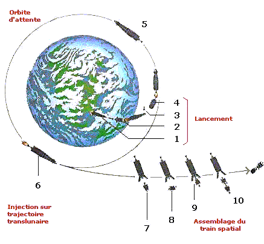

*Réponse publiée [sur Quora](https://fr.quora.com/Aller-sur-la-lune-les-fus%C3%A9es-volent-elles-verticalement-puisque-j-ai-l-impression-que-la-lune-est-au-dessus-de-ma-t%C3%AAte-ou-est-ce-qu-une-partie-seulement-du-vol-est-verticale-et-que-le/answer/Dr-Goulu)*

Toutes les fusées décollent verticalement pour atteindre la haute atmosphère, là où le frottement de l'air diminue assez pour qu'elles puissent atteindre de hautes vitesses.

Puis elles pivotent vers l'est pour profiter de la vitesse de rotation de la Terre (~1700 km/h à l'équateur) et se mettre en orbite autour de la Terre

Ca c'est valable pour (presque) toutes les fusées qui mettent des satellites en orbite

Pour aller vers la Lune, Mars, ou n'importe quelle autre planète, on met en marche une deuxième fusée à un certain point de l'orbite pour s' "injecter" sur la bonne trajectoire en tenant compte

- de la position où sera la planète quand on l'atteindra, parce que par exemple la Lune se déplace à 1 km/s sur son orbite, donc pendant les 2 jours du trajet elle bouge de 48*3600=173000 km environ
- de l'attraction de la Terre qui va incurver la trajectoire, surtout au début
- de l'attraction de la Lune ou de la planète qui va incurver la trajectoire vers la fin, ce qui est le but puisqu'on veut en général se mettre en orbite autour de la destination
- le tout en consommant le moins de carburant possible

[Le plan de vol d'Apollo 11](http://www.chokier.com/FILES/APOLLO11/Apollo11-PlanVol.html) (disponible en poster) vous en dira plus

Pendant ce temps, vous sur la Terre vous faites plusieurs tours, donc le haut, le bas et n'ont aucune importance dans l'histoire.
