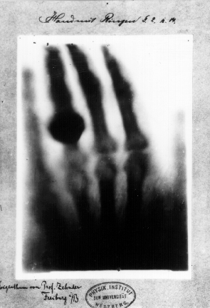

*Réponse publiée [sur Quora](https://fr.quora.com/Quelles-sont-les-photos-qui-ne-peuvent-%C3%AAtre-expliqu%C3%A9es-logiquement/answer/Dr-Goulu)*

La logique n'a rien à voir avec la photographie.

La photographie fonctionne avec une optique qui projette les rayons lumineux d'une scène sur une surface sensible à la lumière, soit chimiquement (cas des bons vieux films et autres plaques sensibles), soit électroniquement (capteurs CCD) pour faire simple.

Ca c'est pour les photos "dans le visible", car on a découvert il y a longtemps, parfois accidentellement, que des rayons invisibles pouvaient aussi faire réagir certains films chimiques ou capteurs, rendant ainsi visibles des choses invisibles à l'oeil.

Donc si vous trouvez une photo "illogique", c'est probablement que vous ne savez pas comment elle a été prise.

Exemples :

image de la main de la femme de [Wilhelm Röntgen](w:) exposée aux rayons X. Quand il faut un cobaye …

Les "photos d'aura" que tous les paramachins adorent depuis la [Photographie Kirlian](w:)sont un simple [Effet corona](w:) : une faible luminescence due à l'ionisation de l'air autour d'un sujet chargé électriquement.

Hou le fantôme ! Non, c'est juste un [portrait en infrarouge](http://infrarouge.photo/2017/12/01/le-portrait-en-infrarouge/)

Mais la photo que je trouve la plus "illogique", c'est cette photo du Soleil :

Elle est moche, très pixellisée, mais elle a été prise à minuit, à travers la Terre, [en “lumière de neutrinos”](http://strangepaths.com/le-soleil-vu-a-travers-la-terre-en-lumiere-de-neutrinos/2007/01/06/fr/) .
