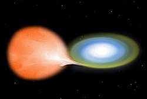

*Réponse publiée [sur Quora](https://fr.quora.com/Pourquoi-les-%C3%A9toiles-binaires-nentrent-elles-pas-en-collision/answer/Dr-Goulu)*

Ca arrive.

Mais d'abord il fut comprendre que les [Étoiles binaires](w:Étoile_binaire)(ou triples) se forment quasi en même temps dans un système.

Jupiter est trop peu massive pour s'allumer, mais si elle avait été plus grosse (13x pour une naine brune, 75x pour une "vraie étoile"), le système solaire aurait été double, le Soleil et Jupiter orbitant autour de leur centre de gravité commun, comme maintenant d'ailleurs.

De même qu'il n'y a aucune raison que Jupiter entre en collision avec le Soleil, il n'y a aucune raison que deux étoiles d'un système double se percutent si elles sont à bonne distance l'une de l'autre.

Mais si les étoiles sont très proches, il peut se passer plusieurs choses:

- une des étoiles peut peu à peu absorber de la matière de l'autre, en capturant son "vent solaire" puis carrément son atmosphère. Ca produit en général une [Nova](w:), mais si la [naine blanche se transforme en étoile à neutrons](w:Transformation_d'une_naine_blanche_en_étoile_à_neutrons) , ça r en [Supernova thermonucléaire (ou 1-a) à progéniteur simple](w:Supernova_thermonucléaire) . Là il n'y a pas vraiment de collision mais plutôt absorption puis destruction de l'une des étoiles. Ou des deux.

- Si les deux étoiles sont des naines blanches orbitant très vite l'une autour de l'autre, en quelques heures seulement donc nettement à l'intérieur de l'orbite de Mercure pour fixer les idées, le système va perdre de l'énergie par émission d'ondes gravitationnelles et les deux étoiles vont se rapprocher en spirale jusqu'à fusionner et créer une [Supernova 1-a à progéniteur double](w:Supernova_thermonucléaire) . D'après ce qu'on voit dans les galaxies voisines et l'analyse chimique des naines blanches proche de nous, on estime que ça arrive une fois par siècle dans la Voie Lactée. C'est donc très fréquent.
- si une des étoiles voire les deux sont des étoiles à neutrons proches, par le même mécanisme il va se produire une [Fusion d'étoiles à neutrons](w:)et là c'est la fête chez les astrophysiciens. Par exemple la "[Kilonova](w:)" de la [Fusion d'étoiles à neutrons du 17 août 2017](w:)a été mesurée à la fois dans l'optique et dans les ondes gravitationnelles, ce qui a permis de confirmer une foultitude d'hypothèses sur tout ce qui précède.
