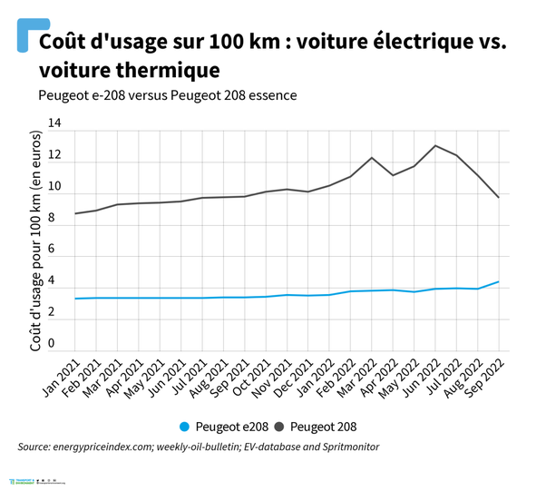
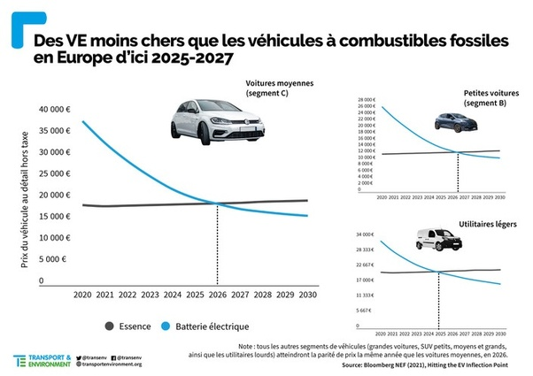
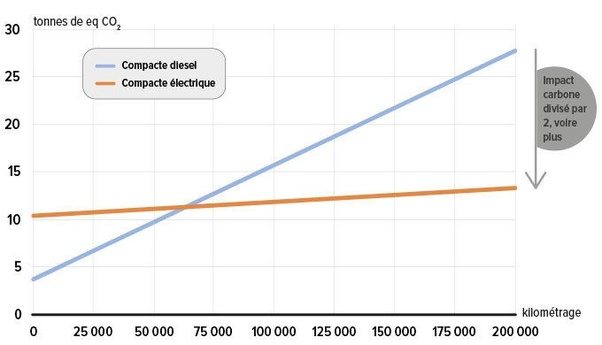

*Réponse publiée [sur Quora](https://fr.quora.com/Le-v%C3%A9hicule-%C3%A9lectrique-est-il-r%C3%A9ellement-rentable/answer/Dr-Goulu)*

Pour que quelque chose soit rentable, il faut que ça vous rapporte du fric. Donc un véhicule électrique rentable, c'est un train sur une bonne ligne, un trolleybus bien subventionné ou un taxi électrique (il y en a de plus en plus) Ou une voiture de location à la rigueur.

Votre véhicule à vous, il vous coûte, il n'est jamais [r](http://rentable.Il)entable. Il peut juste vous coûter plus ou moins cher.

Et là ya pas photo : le coût au km d'une voiture électrique est environ le tiers de son équivalent à essence

(source [Charger sa voiture électrique, plus cher qu’un plein d’essence ?](https://www.transportenvironment.org/discover/la-voiture-electrique-est-elle-penalisee-par-la-hausse-des-prix-de-lelectricite/) )

les voitures électriques ont encore un léger surcoût parce qu'elles sont fabriquées en moins grandes séries, qu'il y a un effet de mode etc, mais techniquement elles sont plus simples que des voitures thermiques. Dans deux ou trois ans il n'y aura plus de différence de prix à l'achat

( Source : [La voiture électrique au prix de la voiture thermique ? C'est pour bientôt](https://www.caradisiac.com/la-voiture-electrique-au-prix-de-la-voiture-thermique-c-est-pour-bientot-189879.htm) )

Écologiquement ya pas photo non plus. Même si la voiture électrique dégage effectivement plus de CO2 à fabriquer, après 60'000 km c'est "moins mauvais pour la planète"

( source : [Voitures électriques – Sont-elles vraiment écologiques ?](https://www.quechoisir.org/actualite-voitures-electriques-sont-elles-vraiment-ecologiques-n103891/) )

Surtout que la durée de vie des voitures électriques est bien supérieure (moins de vibrations, de fluides chauds et froids etc…). Il y a des Tesla qui dépassent le million de km, avec un changement de batteries tous les 500'000 km seulement.

[https://www.tomsguide.fr/une-tes...](https://www.tomsguide.fr/une-tesla-model-s-parcourt-17-million-de-km-un-record-mondial-qui-a-necessite-9-moteurs/)

En combinaison avec les véhicules autonomes, il est très probable que beaucoup de gens n'achèterons plus un véhicule mais le loueront quand ils en auront besoin, et le véhicule viendra les chercher et les déposer chez eux, comme un taxi mais sans chauffeur.

Ca ça sera "rentable" et fera énormément diminuer les tonnes de tole et de lithium stockées dans les garages,
