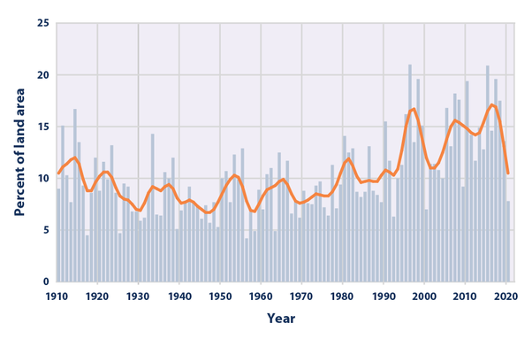

*Réponse publiée [sur Quora](https://fr.quora.com/Pourquoi-dit-on-que-le-changement-climatique-est-responsable-des-catastrophes-naturelles/answer/Dr-Goulu)*

"On" ne dit pas que le changement climatique est responsable de toutes les catastrophes naturelles.

"On" a étudié et démontré scientifiquement que certains types de catastrophes naturelles sont plus fréquentes et/ou statistiquement plus violentes en raison du réchauffement climatique.

- les glissements de terrain dans les régions de permafrost [[1]](#vSXVi) , principalement les régions nordiques et de montagne [[2]](#TXZxF) [[3]](#FnWWt). Assez logique…
- le réchauffement provoque l'[Élévation du niveau de la mer](w:). Déjà 10 cm depuis 1980. C'est un détail pour vous mais pour les millions de gens qui vivent dans les deltas des fleuves à 1m d'altitude, ça veut dire beaucoup : ces 10 cm provoquent des inondations plus fréquentes, voire la [Salinisation](w:)de leurs terres agricoles.
- le réchauffement des océans produit une évaporation plus importantes, donc des pluies exceptionnelles plus fréquentes[[4]](#qtiVw)

(fraction du territoire des USA touchés par des pluies exceptionnelles)

- paradoxalement, les modèles conduisent aussi à des périodes de sécheresse plus longues, notamment en Europe.

Cependant, pour l'effet du climat sur les tornades[[5]](#XcmYq) et les cyclones n'est pas formellement démontré. Pour l'instant

Notes de bas de page

[[1]](#cite-vSXVi)[Landslides in a changing climate](https://www.sciencedirect.com/science/article/pii/S0012825216302458)

[[2]](#cite-TXZxF)[Réchauffement climatique: l’instabilité du pergélisol augmente la fréquence des écroulements](https://www.bafu.admin.ch/bafu/fr/home/themes/dangers-naturels/dossiers/rechauffement-climatique-et-ecroulements.html)

[[3]](#cite-FnWWt)[Climate Change Could Trigger More Landslides in High Mountain Asia – Climate Change: Vital Signs of the Planet](https://climate.nasa.gov/news/2951/climate-change-could-trigger-more-landslides-in-high-mountain-asia/)

[[4]](#cite-qtiVw)[Climate Change Indicators: Heavy Precipitation | US EPA](https://www.epa.gov/climate-indicators/climate-change-indicators-heavy-precipitation)

[[5]](#cite-XcmYq)[Tornadoes and Climate Change](https://education.nationalgeographic.org/resource/tornadoes-and-climate-change/)
