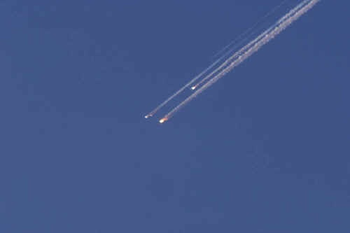

*Réponse publiée [sur Quora](https://fr.quora.com/Quelle-formule-physique-doit-on-utiliser-pour-calculer-la-vitesse-d-une-com%C3%A8te-ou-d-un-vaisseau-spatial-entrant-dans-l-atmosph%C3%A8re-terrestre-sachant-qu-il-a-acquis-une-vitesse-initiale-v0/answer/Dr-Goulu)*

c'est très compliqué. Ca dépend de la forme de l'objet (son Cx) et si elle varie (objet tournant), si il y a une portance, de l'angle d'entrée, de la densité de l'air à chaque altitude, si on part de très haut, le g=9.81 varie etc. etc. etc.

Donc ça se résout par l'intégration numérique (on calcule itérativement ce qui se passe chaque seconde)

Voilà le résultat pour la rentrée de la navette spatiale :

Elle rentre à 130 km d'altitude à une vitesse de 7.5 km/s quasiment en "vitesse terminale" presque constante.

Le freinage aérodynamique commence vers 80 km d'altitude jusque vers 55km ou la vitesse descend à 3km/s. La mention "Rupture des communications" dans le bloc noir est très intéressante : pendant cette phase de freinage, l'air autour de la navette chauffe tellement qu'il rayonne dans le spectre radio.

C'est à ces altitude que les météorites deviennent lumineuses, des "étoiles filantes". Et les navettes aussi… [Columbia s'est désintégrée à 61712m d'altitude](http://www.capcomespace.net/dossiers/espace_US/shuttle/1996-2005/STS107/enquete.htm) et ça a donné ça :

On voit sur le graphique que la différence entre une météorite et une navette se résume aux dernières minutes du vol, en dessous de 10'000m où la navette stabilise sa vitesse et plane alors que la météorite impacterait le sol à 1 ou 2 km/s "seulement", si elle ne s'est pas évaporée avant.
