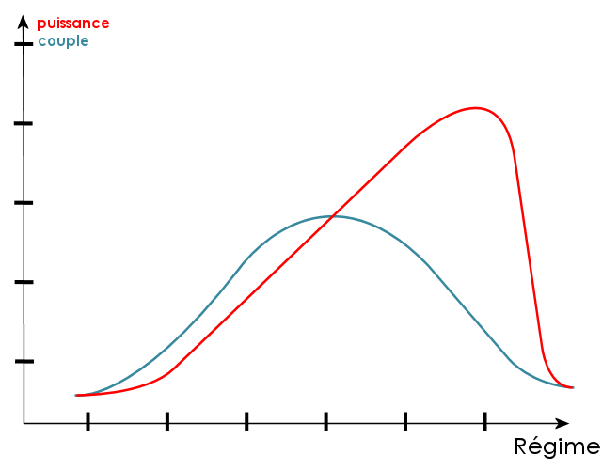
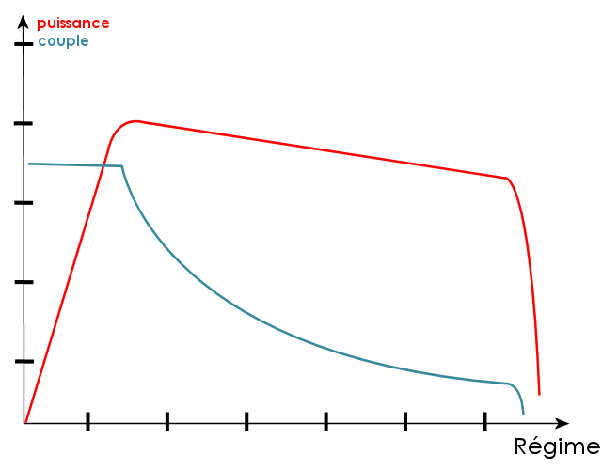

*Réponse publiée [sur Quora](https://fr.quora.com/Expliquez-pourquoi-une-voiture-hybride-qui-est-tr%C3%A9s-complexe-peut-elle-consommer-en-MOYENNE-moins-de-carburant-quune-voiture-%C3%A0-moteur-thermique/answer/Dr-Goulu)*

Parce qu'un moteur thermique a un rendement qui dépend pas mal de son régime (vitesse de rotation):

- il vous force à mettre le gaz et à jouer sur l'embrayage pour démarrer
- il vous force à changer de vitesses, et re embrayage, et re pertes mécaniques
- il consomme beaucoup à haute vitesse (quand vous auriez envie d'avoir une 7ème ou une 8ème)

tout ça résumé dans ce graphique

Alors que pour une moteur électrique on a ça :

- couple max à régime nul pour des départs canon sans embrayage
- puissance quasi constante à tous les régimes
- la récupération d'énergie dont d'autres ont parlé.

Ya pas photo : un moteur thermique n'est meilleur qu'une fois bien lancé sur l'autoroute pour faire 500 km. Dans le trafic, en ville, start/stop, ya pas mieux que l'électrique.
