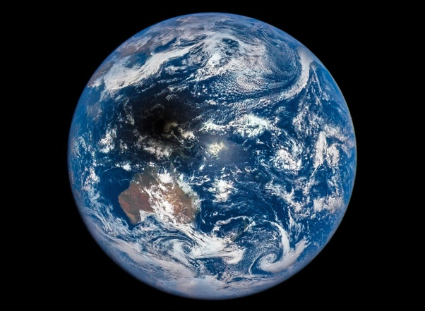

*Réponse publiée [sur Quora](https://fr.quora.com/Et-si-une-%C3%A9clipse-solaire-durait-1-an-Cons%C3%A9quences-sur-les-diff%C3%A9rentes-faunes-et-flores-sur-loc%C3%A9an-animaux-diurnes-%C3%A9volution-chez-lhumain-ou-autre-etc/answer/Dr-Goulu)*

Une eclipse de soleil vue de l'espace, c'est ça :

Vous voyez que l'ombre totale correspondant à l'eclipse totale est petite, elle ne fait que 170km de diamètre au maximum, mais la zone de pénombre où on voit une éclipse partielle peut atteindre 6000 km[[1]](#fqBaa) C'est pour ça que les éclipses solaires ne sont visibles qu'à certains endroits.

Si la Lune avait la drole d'idée de s'immobiliser au [Point de Lagrange L1](w:Point_de_Lagrange) le seul point théoriquement possible entre la Terre et le Soleil, elle serait à 1.5 millions de km , donc 4x plus loin que maintenant et au pif il n'y aurait plus d'éclipse totale sur Terre, mais une pénombre 4x plus grande, qui recouvrirait donc tout l'hémisphère éclairé de la Terre, donc on aurait une éclipse partielle chaque jour…

Il faudrait faire les calculs, mais au pif toujours on n'aurait plus de problème de réchauffement climatique, plutôt une glaciation perpétuelle. Sur un an, on aurait déjà un gros refroidissement.

Il y a d'ailleurs des idées pour mettre un parasol géant en L1 pour bloquer 2 à 4% du rayonnement solaire pour contrecarrer le réchauffement climatique.

[https://www.universetoday.com/15...](https://www.universetoday.com/159133/to-fight-climate-change-we-could-block-the-sun-a-lightweight-solar-sail-could-make-it-feasible/)

Pour l'instant c'est de la science-fiction qui fait sourire, mais quand on aura plus le choix, on le fera.

Notes de bas de page

[[1]](#cite-fqBaa)[Alloprof aide aux devoirs | Alloprof](https://www.alloprof.qc.ca/fr/eleves/bv/sciences/les-eclipses-lunaires-et-solaires-s1402)
