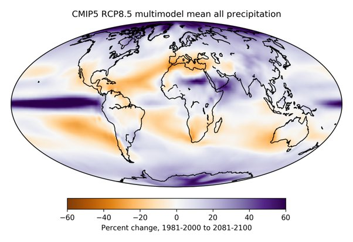
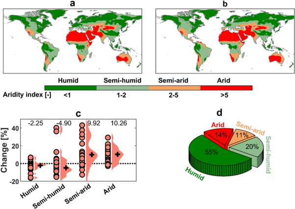

*Réponse publiée [sur Quora](https://fr.quora.com/Quel-les-effets-du-r%C3%A9chauffement-climatique-sur-lAfrique-du-nord-et-la-p%C3%A9ninsule-ib%C3%A9rique-Seront-ils-un-nouveau-Sahara-dans-un-futur-moyen-terme/answer/Dr-Goulu)*

L'effet du réchauffement climatique sur les précipitations est assez difficile à prévoir.

La combinaison des résultats de différents modèles donne le consensus actuel suivant : à la fin de ce siècle, l'Espagne et le nord de l'Atlas recevront en effet environ 40% de moins des précipitations qu'elles recevaient à la fin du 20ème siècle :

( source: [Explainer: What climate models tell us about future rainfall - Carbon Brief](https://www.carbonbrief.org/explainer-what-climate-models-tell-us-about-future-rainfall/) )

Ca reste quand même beaucoup plus que le Sahara, qui devrait en partie recevoir plus de pluies , et donc ne changera pas notablement la répartition des zones sur Terre, mais l'Espagne passera en effet de zone "semi humide" à "semi aride", avec même un début de zone aride au sud.

(source : [Climate change impact on flood and extreme precipitation increases with water availability - Scientific Reports](https://www.nature.com/articles/s41598-020-70816-2) , Nature)
