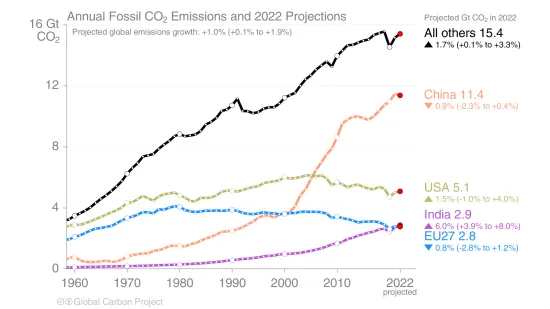

*Réponse publiée [sur Quora](https://fr.quora.com/Pourquoi-les-humains-ne-veulent-pas-s-unir-contre-le-r%C3%A9chauffement-climatique-qui-va-tuer-des-humains-et-des-animaux-innocents-Aucun-pays-ne-veut-r%C3%A9duire-ses-%C3%A9missions-des-gaz-%C3%A0-effets/answer/Dr-Goulu)*

Tous les pays veulent réduire leurs émissions, et s'y sont engagés en 2015 à l'[Accord de Paris sur le climat](w:), et beaucoup y arrivent : l'Europe les réduit depuis 1980 environ et les USA depuis 2000 environ.

Des pays comme la Chine ont beaucoup augmenté leurs émissions pendant leur développement économique rapide, mais ils sont en train de stabiliser leurs émissions qui baisseront vers 2050. L'Inde et les pays africains suivront une trajectoire similaire.

On voit qu'au niveau mondial les émissions sont en bonne voie d' être stabilisées vers 2050, selone scénario SSP2-4.5 du GIEC, ce qui donnerait une hausse des températures d'environ 3 degrés à la fin du siècle.

[Scénarios et projections climatiques | Chiffres clés du climat 2022](https://www.statistiques.developpement-durable.gouv.fr/edition-numerique/chiffres-cles-du-climat-2022/3-scenarios-et-projections-climatiques)

Il ne faut pas être pressé : nos parents et grands parents ont mis un bon siècle à accumuler au moins 400 milliards de tonnes de CO2 dans l'atmosphère, ça va prendre plusieurs siècles pour qu'ils soient absorbés.
