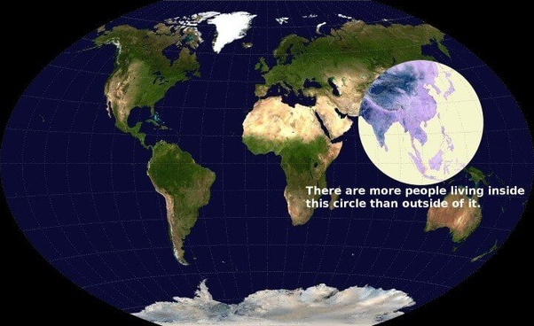

*Réponse publiée [sur Quora](https://fr.quora.com/A-combien-peut-on-estimer-la-population-mondiale-de-nos-jours-et-quel-continent-est-le-plus-peuple-et-riche-en-ressources-naturelles/answer/Dr-Goulu)*

8'049'412'812 sur [Worldometer](https://www.worldometers.info/fr/), dont la moitié, 4 milliards, vivent dans ce cercle:

Je ne sais pas ce que vous appelez "ressources naturelles". Si 4 milliards d'humains vivent dans ce cercle, c'est qu'il y a les ressources pour y vivre, donc je dirais "Asie".
