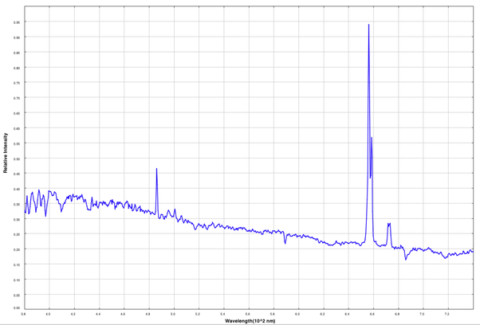

*Réponse publiée [sur Quora](https://fr.quora.com/Comment-les-galaxies-%C3%A9mettent-elles-de-la-lumi%C3%A8re-et-quelles-informations-cela-peut-il-nous-fournir-sur-leur-composition-et-leur-mouvement/answer/Dr-Goulu)*

Comme d'autres l'ont indiqué, la lumière des galaxies est la combinaison de celle de milliards d'étoiles de températures differentes. Elles ont donc un spectre très aplati.

Mais comme les étoiles ont des compositions proches, notamment beaucoup d'hydrogène et d'hélium, leurs pics d'émission se superposent (quasi) parfaitement et on obtient des spectres comme celui de [M83](w:M83_(galaxie))par exemple :

Le plus grand pic d'émission est [Hα de l'hydrogène](w:Hα). Il est tellement connu, étroit et reconnaissable que c est lui qu'on utilise pour mesurer le [Décalage vers le rouge](w:)(ou parfois le bleu) de la galaxie qui donne la [Vitesse radiale](w:)de la galaxie par rapport à nous. Aujourd'hui on arrive à mesurer ça avec une précision de quelques m/s!

Pour des galaxies proches, on arrive même à faire ceci sur des zones distinctes de la galaxie pour déterminer la [Courbe de rotation des galaxies](w:)ainsi que des variations de la populations des étoiles, ce qui a permis de mieux comprendre l'[Évolution stellaire](w:).

De plus, on arrive à détecter les variations de luminosité périodiques produites par les [Céphéides](w:Céphéide), ce qui a permis de mesurer la distance des galaxies pas trop éloignées, et de s'apercevoir que plus elles étaient loin, plus leur décalage vers le rouge était élevé, donc plus elles s'éloignent vite de nous.

Plus haut j'ai écrit que les pics d'émission des étoiles comme Ha étaient quasi superposés. En fait, en raison des mouvements propres des étoiles dans la galaxie, la raie de chaque étoile est légèrement décalée, ce qui fait que la largeur du pic Ha de la galaxie renseigne sur la distribution des vitesses des étoiles dans la galaxie.

La lumière des galaxies a complètement bouleversé notre vision de l'univers.
