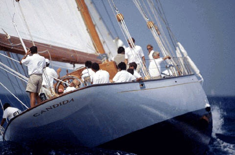

*Réponse publiée [sur Quora](https://fr.quora.com/Si-vous-aviez-un-voilier-quel-nom-lui-donneriez-vous/answer/Dr-Goulu)*

"No Future" sprayé en rouge.

L'idée nous est venue dans le port d'Antibes en voyant un type passer 3 jours à rafraîchir le nom de ce bateau avec un petit pinceau et de la peinture dorée :

