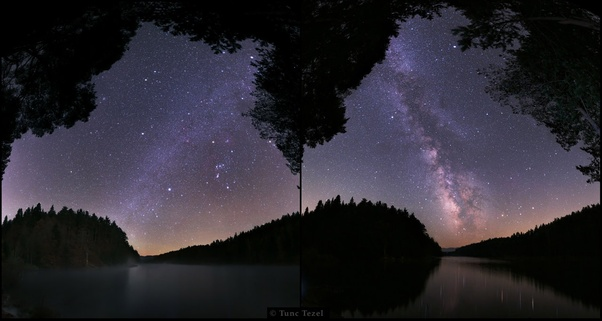

*Réponse publiée [sur Quora](https://fr.quora.com/Pourquoi-voyons-nous-toujours-les-m%C3%AAmes-%C3%A9toiles-alors-que-nous-tournons-autour-du-Soleil/answer/Dr-Goulu)*

Vous êtes sur ?

Regardez mieux.

Vous ne voyez pas le mêmes étoiles en hiver qu'en été depuis un même endroit.

Pourquoi ? Parce que nous tournons autour du Soleil.

deux photos du ciel prises à 6 mois d'intervalle
