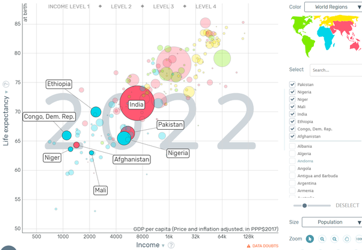
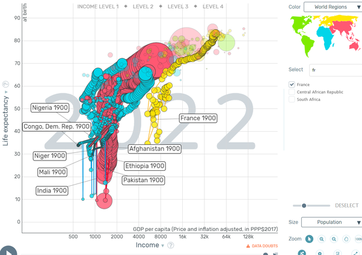
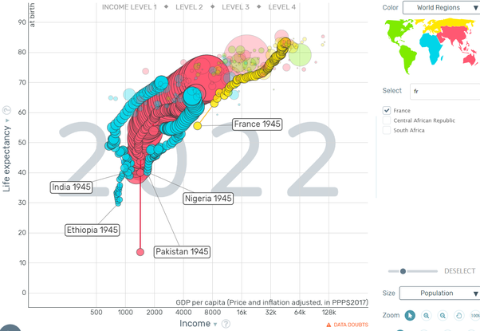

*Réponse publiée [sur Quora](https://fr.quora.com/Comment-expliquer-un-tel-retard-end%C3%A9mique-de-d%C3%A9veloppement-global-%C3%A9conomie-%C3%A9ducation-sant%C3%A9-alimentation-en-Afrique-notamment-subsaharienne/answer/Dr-Goulu)*

Commençons par vérifier vos affirmations si vous voulez bien.

Grâce au génial [Gapminder](https://www.gapminder.org/tools/#$model$markers$bubble$encoding$y$scale$zoomed@:52.52&:85.25;;;&x$scale$zoomed@:576.15&:170806.77;;;&trail$data$filter$markers$nga=2022&sdn=2022&pak=2022;;;;;;;;&chart-type=bubbles&url=v1)de Hans Rosling, on peut visualiser les données statistiques de tous les pays du monde. Voici la carte avec le PIB par habitant en abscisse et l'espérance de vie en ordonnée:

Vous voyez que les pays d'Afrique subsaharienne (en bleu) sont un peu à la traîne, mais certains ne le sont pas tant que ça, le Nigeria (et les 4 autres plus petits non mis en évidence (Côte d'Ivoire, Ghana, Angola et Kenya) sont dans la même situation que le Pakistan par exemple.

Un Soudanais a la même espérance de vie qu'un Indien, par exemple, mais toujours un revenu plus faible.

Effectivement, il y a encore beaucoup de pays "bleus" qui sont dans la situation actuelle de l'Afghanistan (le point rouge le plus à gauche). Ce sont pour la plupart des pays en guerre ou ayant connu des guerres récemment : RDC, Sierra Leone, Mali par exemple

Après, ce qu'on peut faire de génial avec Gapminder, c'est de visualiser la trace de l'évolution de ces pays, alors voilà ce qu'il s'est passé :

C'est un peu fouillis, mais vous pouvez jouer avec [le lien](https://www.gapminder.org/tools/#$model$markers$bubble$encoding$y$scale$zoomed@:3.55&:88.03;;;&x$scale$zoomed@:184.07&:180000;;;&trail$data$filter$markers$pak=1900&nga=1900&ind=1900&eth=1900&afg=1900&cod=1900&mli=1900&ner=1900&fra=1900;;;;;;;;&chart-type=bubbles&url=v1) pour vous convaincre d'une chose ultra importante :

**le développement de tous les pays suit environ la même trajectoire, juste décalée dans le temps.**

Je vous fais un petit zoom sur quelques pays depuis 1945 :

Le Nigeria est aujourd'hui dans la situation économique de la France de 1945, avec l'espérance de vie de la France de 1948.

L'Ethiopie est plus pauvre mais la pente de sa croissance économique et en espérance de vie est la même que celle de l'Inde, la même que celle de la France, la même que celle de presque tous les pays sur une longue période.

On peut faire la même chose avec

Le retard endémique de l'Afrique est juste un retard temporel, pas structurel. Ce sera l'eldorado de l'économie dans les prochaines décennies. Pas pour rien que Vladimir et Xi s'y intéressent de très près, et font tout pour nous en désintéresser.
