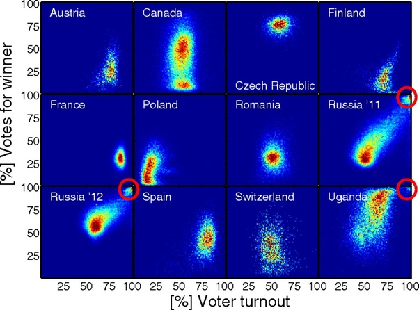

*Réponse publiée [sur Quora](https://fr.quora.com/On-dit-que-Poutine-est-elu-d%C3%A9mocratiquement-par-le-peuple-A-l-image-des-referendums-dans-le-Dombas-ou-la-Crim%C3%A9e-ces-scrutins-sont-ils-truqu%C3%A9s-Dans-nos-m%C3%A9dias-on-parle-de-bourrage-des/answer/Dr-Goulu)*

Le bourrage d'urnes lors des élections en Russie se détecte très facilement avec une méthode toute simple décrite dans cet article :

Klimeka, P., Yegorovb, Y., Hanela, R., & Thurner, S. (2012). Statistical detection of systematic election irregularities. *Proceedings of the National Academy of Sciences of the United States of America*, *109*(41), 16469–16473. [doi/10.1073/pnas.1210722109](https://www.pnas.org/doi/full/10.1073/pnas.1210722109)

Dans les cercles rouges se trouvent les circonscriptions où 100% des inscrits se sont exprimés à 100% en faveur du vainqueur (Poutine, son parti ou ses sbires locaux). Les"traînées" en diagonale sont louches aussi.

Ce qui est intéressant, c'est qu'il aurait gagné sans fraude (position verticale du nuage principal), du moins en 2012.
