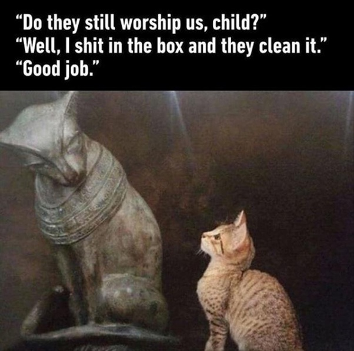

*Réponse publiée [sur Quora](https://fr.quora.com/Un-chat-peut-il-avoir-plusieurs-ma%C3%AEtres-simultan%C3%A9ment/answer/Dr-Goulu)*

Un chat n'a aucun maître.

Il peut avoir plusieurs esclaves, en effet.

