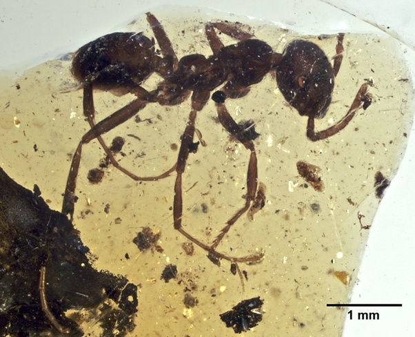

*Réponse publiée [sur Quora](https://fr.quora.com/Quel-est-l-%C3%A2ge-de-l-apparition-de-la-fourmi-Et-a-t-on-deja-vu-ses-vestiges-arch%C3%A9ologiques/answer/Dr-Goulu)*

Environ 120 millions d'années.

Les "vestiges archéologiques" s'appellent des fossiles, et le plus ancien connu a été découvert dans de l'ambre en Charentes, France et daté de 100 millions d'années :

([Fourmi — Wikipédia](w:Fourmi))
