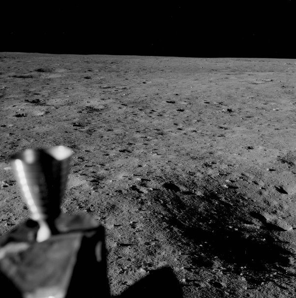

*Réponse publiée [sur Quora](https://fr.quora.com/Pourquoi-les-photos-prise-sur-la-lune-%C3%A9tait-parfaite-et-non-pas-irradi%C3%A9/answer/Dr-Goulu)*

Parce que vous ne regardez pas bien

Sur cette photo, en zoomant sur la partie noire vous verrez

1. Des points fixes. Ce sont des étoiles…
2. Des petits traits blancs : ce sont des rayons cosmiques touchant la pellicule

Après les témoignages de plusieurs astronautes Apollo qui ont rapporté voir des flashs lumineux toutes les 2 à 3 minutes, les astronautes d'Apollo 16 et 17 ont été dotés d'un casque équipé d'un détecteur de rayons cosmiques (ALFMED) qui a confirmé que ces flashs correspondaient à des rayons cosmiques traversant les yeux des astronautes.

[https://en.wikipedia.org/wiki/Co...](w:en:Cosmic_ray_visual_phenomena)

Une fois de plus un argument complotiste se révèle non seulement faux, mais confirmer cette extraordinaire réussite qu'à été le programme Apollo.
