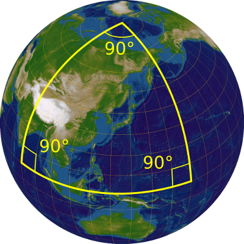

*Réponse publiée [sur Quora](https://fr.quora.com/Y-a-t-il-une-configuration-dans-laquelle-le-th%C3%A9or%C3%A8me-de-Pythagore-ne-fonctionne-pas/answer/Dr-Goulu)*

Bien sur. Pythagore ne marche que dans un espace plat.

Sur une sphère par exemple, ça ne marche plus.

Vous pouvez même faire des triangles rectangles équilatéraux :

[https://www.drgoulu.com/2013/10/...](https://www.drgoulu.com/2013/10/08/de-quelle-couleur-est-lours/#:~:text=dévorer ses provisions.-,De quelle couleur est l'ours ?,qui possède deux angles droits )!
