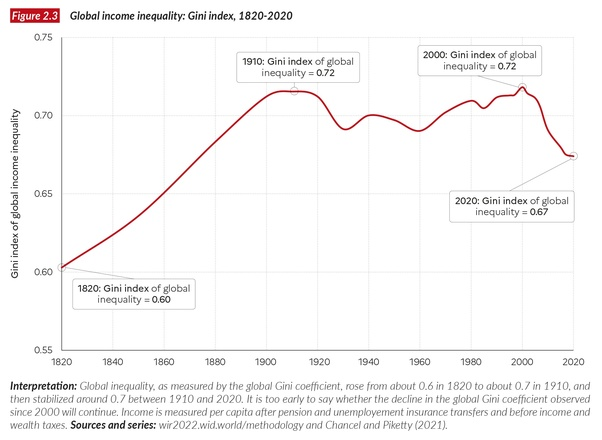

*Réponse publiée [sur Quora](https://fr.quora.com/Quelles-sont-les-raisons-pour-lesquelles-les-in%C3%A9galit%C3%A9s-de-revenus-ont-augment%C3%A9-dans-le-monde-entier-au-cours-des-derni%C3%A8res-d%C3%A9cennies/answer/Dr-Goulu)*

vous êtes mal informé. Au niveau mondial, les inégalités ont diminué de 2000 à 2020 après avoir un peu oscillé depuis 1980

La raison est le développement rapide des BRICS, où le revenu de 2 ou 3 milliards de personnes a augmenté rapidement, se rapprochant du niveau des pays industrialisés.

source et détails :

[https://wir2022.wid.world/chapte...](https://wir2022.wid.world/chapter-2/)
