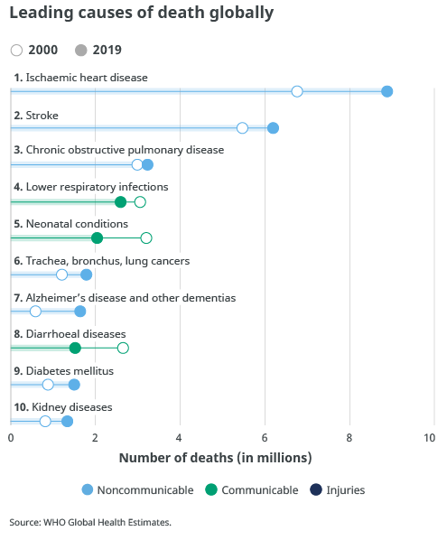

*Réponse publiée [sur Quora](https://fr.quora.com/Combien-de-personnes-savent-que-la-peur-estpus-meurtri%C3%A8re-qu-une-maladie/answer/Dr-Goulu)*

Ceux qui ne savent pas compter.

A part la 2eme cause de mortalité dans le monde (AVC) et la 5eme (conditions néonatales), 8 des 10 principales causes de mortalité dans le monde sont des maladies

En 2022 vous pouvez ajouter 7 millions de morts du Covid-19, juste en passant.

La peur, c'est 1% des crises cardiaques, à tout casser.

Donc, faut pas raconter n'importe quoi.
