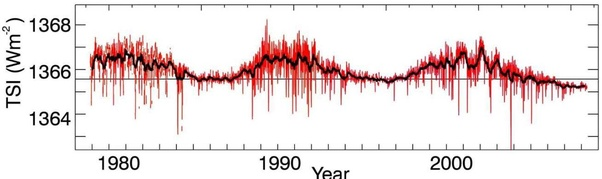

*Réponse publiée [sur Quora](https://fr.quora.com/Pourquoi-le-r%C3%A9chauffement-climatique-proviendrait-il-de-l-activit%C3%A9-humaine-alors-que-la-hausse-moyenne-des-temp%C3%A9ratures-est-identique-%C3%A9galement-sur-la-Lune-et-Mars/answer/Dr-Goulu)*

L'explication logique serait alors que la luminosité solaire augmente.

Manque de pot, les mesures ultra précises par satellite depuis 1978 montrent que non[[1]](#mUKkk)

On voit clairement une variation de 0.1% avec un cycle de 11 ans, mais plutôt une légère tendance à la baisse sur la période mesurée.

Il y a encore un autre léger problème : le réchauffement terrestre a lieu près de la surface, pas en haute altitude. Un peu comme si c'était le rayonnement infrarouge du sol qui était plus absorbé qu'avant, et pas du tout comme si on recevait plus de chaleur "d'en haut".

Il faudrait peut-être vérifier vos informations selon lesquelles la Lune et Mars se réchauffent aussi, parce que si par hasard ça n'était pas vrai, ça ferait encore un argument de plus en faveur du réchauffement anthropique, qu'en pensez vous ?

Notes de bas de page

[[1]](#cite-mUKkk)[Solar Irradience Variation](https://www.imperial.ac.uk/a-z-research/astrophysics/research/the-sun/solar-irradience-variation/#:~:text=The variation of solar energy,and limited to the ultraviolet.)
