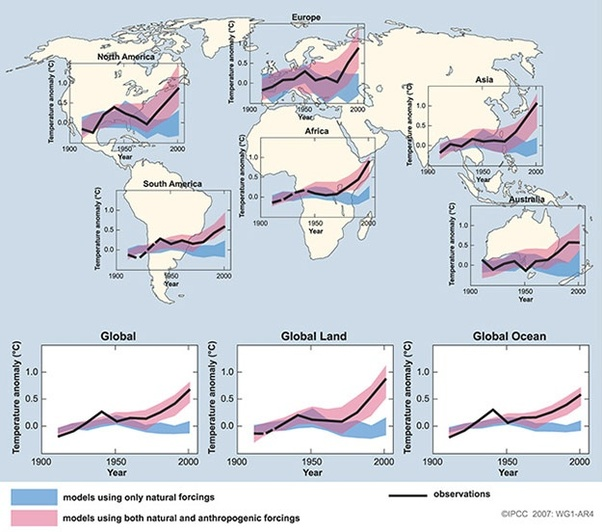

*Réponse publiée [sur Quora](https://fr.quora.com/Existe-t-il-une-%C3%A9tude-contrefactuelle-sur-le-climat-dans-laquelle-l-influence-humaine-a-%C3%A9t%C3%A9-totalement-%C3%A9limin%C3%A9e-afin-de-d%C3%A9terminer-quelles-seraient-les-temp%C3%A9ratures-sur-Terre-aujourd/answer/Dr-Goulu)*

Oui bien sur. Il y en a même eu beaucoup, synthétisées dans cette célèbre figure du rapport 2007 du GIEC

Google translate vous a traduit la légende :

> Comparaison des variations observées continentales et globales de la température de surface avec des résultats simulés par des modèles climatiques utilisant des forçages naturels et anthropiques. Les moyennes décennales des observations sont indiquées pour la période 1906 à 2005 (ligne noire) tracée contre le centre de la décennie et par rapport à la moyenne correspondante pour 1901-1950. Les lignes sont pointillées où la couverture spatiale est inférieure à 50%. Les bandes bleus ombragées montrent la plage de 5 à 95% pour 19 simulations de cinq modèles climatiques utilisant uniquement les décors naturels dues à l'activité solaire et aux volcans. Les bandes ombragées rouges montrent la plage de 5 à 95% pour 58 simulations de 14 modèles climatiques utilisant des forçages naturels et anthropiques.

En résumé :

1. Les simulations (en rouge) correspondent bien aux températures mesurées
2. En enlevant les gaz à effet de serre anthropiques, il n y a pas d'augmentation de la température
3. Depuis 1980 environ, les températures mesurées ne sont plus compatibles avec les simulations sans émissions anthropiques.

Comme dit dans la légende, cette figure résume les résultats d'une bonne centaine de publications scientifiques. On peut retrouver les références dans le rapport complet du GIEC.

[https://www.ipcc.ch/site/assets/...](https://www.ipcc.ch/site/assets/uploads/2018/05/ar4_wg1_full_report-1.pdf)

C est autour de la page 703, et les références dans les centaines listées pages 733 à 743.

Il doit certainement y avoir une version plus récente de ceci quelque part, mais je ne sais pas où.
