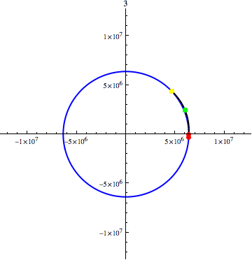

---

title: A quelle vitesse et à quel angle, je dois lancer une pierre de 1kg, pour qu'elle fasse le tour de la terre pour revenir à la position exacte de l'endroit où je l'ai jeté, en négligeant les frottements de l'air ?
slug: a-quelle-vitesse-et-a-quel-angle-je-dois-lancer-une-pierre-de-1kg-pour-qu-elle-fasse-le-tour-de-la-terre-pour-revenir-a-la-position-exacte-de-l-endroit-ou-je-l-ai-jete-en-negligeant-les-frottements-de-l-air
date: '2023-01-16'
draft: false
categories:
- Quora
tags: []
coverImage: ./images/qimg-8105e06505d350802038f0d645c0c9cb.gif
---

*Réponse publiée [sur Quora](https://fr.quora.com/A-quelle-vitesse-et-%C3%A0-quel-angle-je-dois-lancer-une-pierre-de-1kg-pour-qu-elle-fasse-le-tour-de-la-terre-pour-revenir-%C3%A0-la-position-exacte-de-l-endroit-o%C3%B9-je-l-ai-jet%C3%A9-en-n%C3%A9gligeant-les/answer/Dr-Goulu)*

D'après [Jesse Berezovsky's answer to External Ballistics: Under what conditions can a bullet from your gun circle the planet and hit you in the back?](https://www.quora.com/External-Ballistics-Under-what-conditions-can-a-bullet-from-your-gun-circle-the-planet-and-hit-you-in-the-back/answer/Jesse-Berezovsky?ch=10&oid=1966751&share=1e967682&srid=pzDv&target_type=answer)

Il faut tirer à 15 km/s vers l'Ouest et il y a plusieurs angles possibles.

La première solution correspond à un angle de tir d'environ 4.75° par rapport à l'horizontale (la valeur en haut de l'animation ci-dessous)

Dans ce cas, le projectile (dont la masse n'a aucune importance) reviendra au point jaune, qui sera superposé au point rouge mobile, qui représente la position du point de départ (qui tourne vers l'Est pendant l'orbite)

Ensuite il y a une autre solution vers 7.3° dans laquelle la Terre fait un tour complet et un peu plus pendant l'orbite, et plusieurs autres qui correspondent à 2 tours, 3 tours etc

les points verts correspondent à la sortie + entrée dans l'atmosphère (altitude 100km) donc on voit que ça ne change pas grand chose, il faut "juste" un projectile sortant de l'atmosphère à environ 15 km/s.
