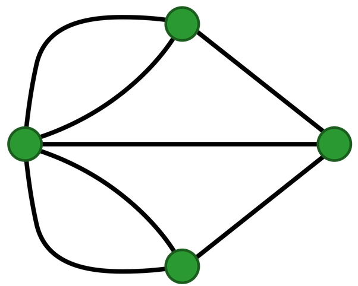

---

title: Combien faudrait-il construire de ponts supplémentaires dans la ville de Königsberg, au minimum, pour qu'il soit possible d'y faire une balade passant une et une seule fois par chaque pont de la ville et revenant en son point de départ ?
slug: combien-faudrait-il-construire-de-ponts-supplementaires-dans-la-ville-de-konigsberg-au-minimum-pour-qu-il-soit-possible-d-y-faire-une-balade-passant-une-et-une-seule-fois-par-chaque-pont-de-la-ville-et-revenant-en-son-point-de-depart
date: '2023-04-18'
draft: false
categories:
- Combien
tags: []
coverImage: ./images/qimg-4e517c7be642ef4c071065d90e994c75.png
---

*Réponse publiée [sur Quora](https://fr.quora.com/Combien-faudrait-il-construire-de-ponts-suppl%C3%A9mentaires-dans-la-ville-de-K%C3%B6nigsberg-au-minimum-pour-qu-il-soit-possible-d-y-faire-une-balade-passant-une-et-une-seule-fois-par-chaque-pont/answer/Dr-Goulu)*

Deux.

Pour qu'un [circuit eulérien](w:Graphe_eulérien) existe, il faut que le degré de tous les sommets soit pair.

Dans le cas de Königsberg, il faut que le nombre de ponts reliant chaque rive ou île soit pair.

Or ce nombre est impair ( 3 ou 5) pour les 4 sommets correspondant à Königsberg

Il faut donc ajouter 2 ponts entre n'importe quelles paires de sommets distincts du graphe

Si on accepte de ne pas faire de circuit fermé, un seul pont suffit et il faut alors partir d'un sommet ayant un degré impair et terminer à l'autre sommet impair.

[https://www.drgoulu.com/2013/11/...](/2013/11/22/le-postier-chinois-de-konigsberg/#.ZD5ocHZByCo)
