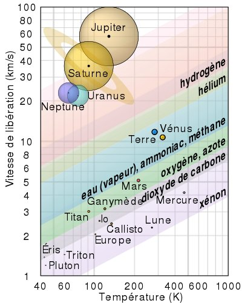

---

title: Comment l'eau (ou autre atmosphère) d'une planète peut-elle s'évaporer dans l'espace alors que pour que de la matière quitte la gravitation planétaire, elle est censée atteindre au moins la vitesse de libération ? (11,2km/s)
slug: comment-l-eau-ou-autre-atmosphere-d-une-planete-peut-elle-s-evaporer-dans-l-espace-alors-que-pour-que-de-la-matiere-quitte-la-gravitation-planetaire-elle-est-censee-atteindre-au-moins-la-vitesse-de-liberation-11-2km-s
date: '2023-02-21'
draft: false
categories:
- Comment
tags:
- physique
- sciences
- astronomie
- astrophysique
- espace
coverImage: ./images/qimg-ab1f5f15bee0381a62499fccb0bc7174.jpg
---

*Réponse publiée [sur Quora](https://fr.quora.com/Comment-leau-ou-autre-atmosph%C3%A8re-dune-plan%C3%A8te-peut-elle-s%C3%A9vaporer-dans-lespace-alors-que-pour-que-de-la-mati%C3%A8re-quitte-la-gravitation-plan%C3%A9taire-elle-est-cens%C3%A9e-atteindre-au-moins-la/answer/Dr-Goulu)*

11.2 km/s c'est pas grand chose pour une molécule. A température ambiante, la vitesse des molécules d'air qui nous environnent est de 500 m/s en moyenne. Supersonique !

A haute altitude, des atomes légers comme l'hydrogène ou l'hélium ont une probabilité non nulle d'avoir la vitesse de libération (à cette altitude, donc plus faible que 11.2 km/s …) et de passer entre les autres jusqu'à l'espace vu la faible densité .

Ce joli graphique de [Échappement atmosphérique](w:)montre quels gaz sont retenus en fonction de la température et vitesse de libération des planètes:

La Terre perd de l'eau indirectement : l'eau se fait [Photolyser](w:Photolyse)par le rayonnement solaire en haute altitude, et l'hydrogène a alors une probabilité de s'échapper .
