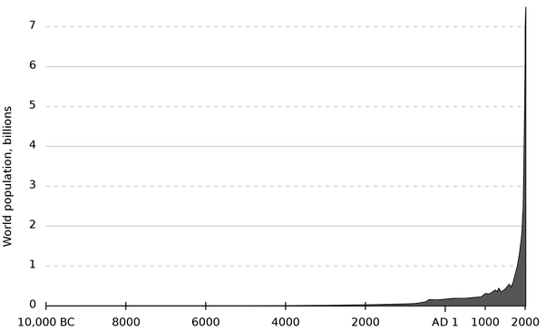

*Réponse publiée [sur Quora](https://fr.quora.com/Comment-lhomme-a-partir-de-la-nature-%C3%A0-pu-construire-des-machine-internet-t%C3%A9l%C3%A9phone-portable-ordinateurs/answer/Dr-Goulu)*

Ca a pris 400'000 ans depuis la [Domestication du feu](w:), et avant les ordinateurs il y a eu l'arc et les flèches, la roue, les bateaux, la machine à vapeur, les avions et plein d'autres machines.

Le progrès technique / scientifique à quelques caractéristiques:

- il s'accumule : nous transmettons à nos descendons ce que nous savons, et ça va beaucoup plus vite avec l'école, l'écriture, et maintenant Wikipedia. Il faut aussi des machines pour faire d'autres machines (suggestion de question très intéressante à laquelle je me ferai une joie de répondre : "comment on a fait des machines précises avec des machines moins précises ?" )
- il se spécialise : on a plus besoin de savoir allumer un feu avec des silex (d'ailleurs c'est pas comme ça qu'on fait) pour fabriquer des puces en silicium. Certains humains peuvent donc se consacrer à 100% à faire avancer le schmilblick sans trop s'inquiéter de ce qu'ils vont manger demain
- tout ça est multiplié par la population qui a fait ça :

- et encore multiplié par l'instruction , qui a multiplié par 10 la proportion de gens sachant lire en un siècle.

Donc tout va de plus en plus extraordinairement vite, au point que certaines personnes dont moi pensent que la

[Singularité technologique](w:Singularité_technologique)

est proche.
