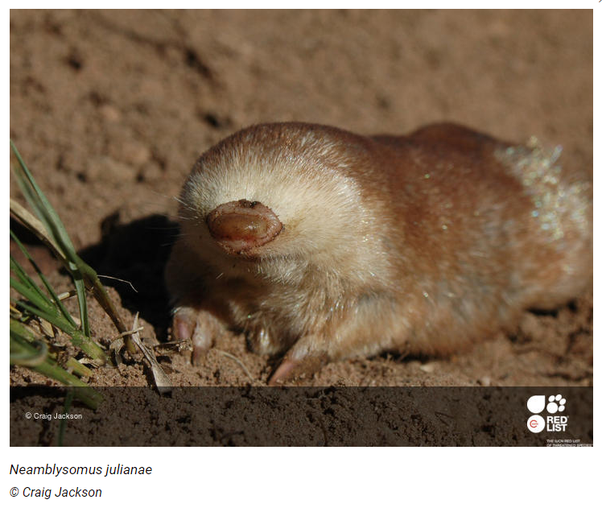

*Réponse publiée [sur Quora](https://fr.quora.com/Comment-les-scientifiques-d%C3%A9terminent-ils-si-un-animal-est-en-voie-de-disparition/answer/Dr-Goulu)*

L' [Union internationale pour la conservation de la nature](w:)(UICN) qui maintient la célèbre [Liste rouge de l'UICN](w:)utilisée notamment sur la Wikipédia procède ainsi :

> Chaque espèce ou sous-espèce peut être classée dans l’une des neuf catégories suivantes : Éteinte (EX), Éteinte à l’état sauvage (EW), En danger critique (CR), En danger (EN), Vulnérable (VU), Quasi menacée (NT), Préoccupation mineure (LC), Données insuffisantes (DD), Non évaluée (NE).
>
>
>
> La classification d’une espèce ou d’une sous-espèce dans l’une des trois catégories d’espèces menacées d’extinction (CR, EN ou VU) s’effectue par le biais d’une série de cinq critères quantitatifs qui forment le cœur du système.
>
>
>
> Ces critères sont basés sur différents facteurs biologiques associés au risque d’extinction : taille de population, taux de déclin, aire de répartition géographique, degré de peuplement et de fragmentation de la répartition.
>
>
>
> ( [La Liste rouge mondiale des espèces menacées - UICN France](https://uicn.fr/liste-rouge-mondiale/) )

En utilisant leur [fantastique base de données](https://web.archive.org/web/20230503153949/https://www.iucnredlist.org/) vous pouvez accéder aux publications qui justifient le classement de chaque espèce. Je ne donne pas l'[exemple de l'ours blanc](https://web.archive.org/web/20230328022757/https://www.iucnredlist.org/species/22823/14871490) parce que c'est une "espèce emblématique" qui cache l'ampleur du vrai problème : l'UICN répertorie **42'100 espèces en voie de disparition** dont personne n'a rien à cirer, alors que l'ours blanc n'est classé "que" VUlnérable.

Donc je vais prendre une des espèces mise en avant sur la page d'accueil, mais mignonne quand même parce qu'il y en a ici qui considèrent les insectes et les serpents comme ayant moins de valeur que les ours blancs. Donc ce sera

La Taupe dorée de Juliana ( [Juliana's golden mole - Wikipedia](w:en:Juliana's_golden_mole) ), qui vit encore dans 3 ou 4 petites zones d'Afrique du Sud.

[Sur sa page de l'UICN](https://web.archive.org/web/20221025145922/https://www.iucnredlist.org/species/1089/21285354), vous pouvez consulter toutes les informations et l'historique relatif à son classement.

Il y a notamment la section "Bibliographie" qui liste toutes les études scientifiques relatives à cette mignonne taupe dont vous n'avez jamais entendu parler :

1. Afrotheria Specialist Group. 2014. Specialist Group website. Available at: [IUCN Afrotheria Specialist Group](http://www.afrotheria.net/index.php).
2. Bronner, G.N. 1990. New distribution records for four mammal species, with notes on their taxonomy and ecology. Koedoe 33: 1-7.
3. Bronner, G.N. 1995. Cytogenetic properties of nine species of golden moles (Insectivora: Chrysochloridae). Journal of Mammalogy 76: 957-971.
4. Bronner, G.N. 1995. Systematic revision of the golden mole genera Amblysomus, Chlorotalpa and Calcochloris (Insectivora: Chrysochloromorpha; Chrysochloridae). Ph.D. Thesis, University of Natal.
5. Bronner, G.N. 2013. Neamblysomus julianae. In: J. Kingdon, D. Happold, T. Butynski, M. Hoffmann, M. Happold and J. Kalina (eds), Mammals of Africa, Volume I: Introductory Chapters and Afrotheria, pp. 253-254. Bloomsbury Publishing, London.
6. Bronner, G.N. and Bennett, N.C. 2005. Order Afrosoricida. In: J.D. Skinner and C.T. Chimimba (eds), The Mammals of the Southern African Subregion, 3rd edn, Cambridge University Press, Cambridge.
7. Bronner, G.N. and Jenkins, P.D. 2005. Order Afrosoricida. In: D.E. Wilson and D.M. Reeder (eds), Mammal Species of the World, pp. 70-81. The Johns Hopkins University Press, Baltimore, MD, USA.
8. IUCN. 2015. The IUCN Red List of Threatened Species. Version 2015.2. Available at: [The IUCN Red List of Threatened Species](https://web.archive.org/web/20230503153949/http://www.iucnredlist.org). (Accessed: 23 June 2015).
9. Jackson, C.R. 2007. The ecology and conservation of Juliana's golden mole (Neamblysomus julianae) . University of Pretoria.
10. Jackson, C.R. and Robertson, M.P. 2011. Predicting the potential distribution of an endangered cryptic subterranean mammal from few occurrence records. Journal for Nature Conservation 19: 87-94.
11. Jackson, C.R., Lubbe, N.R., Robertson, M.P., Setsaas, T.H., van der Waals, J. and Bennett, N.C. 2007. Soil properties and the distribution of the endangered Juliana’s golden mole. Journal of Zoology 274: 13-17.
12. Jackson, C.R., Maree, S., Robertson, M.P., Bloomer, P., Bennett, N.C. and Bronner, G.N. 2007. A Conservation Assessment of Juliana’s Golden Mole (Neamblysomus julianae) on the Bronberg Ridge, Gauteng, South Africa. Technical report compiled for Gauteng Provincial Government, Department of Agriculture, Conservation and Environment.
13. Jackson, C.R., Setsaas, T. H., Robertson, M.P. and Bennett, N.C. 2008. Ecological variables governing habitat quality and the distribution of the endangered Juliana’s golden mole. African Zoology 43: 245-255.
14. Jackson, C.R., Setsaas T.H., Robertson M.P., Scantlebury M. and Bennett N.C. 2009. Insights into torpor and behavioural thermoregulation of the endangered Juliana's golden mole. . Journal of Zoology 278: 299–307.
15. Maree, S., Bronner, G.N., Jackson, CR. and Bennett, N.C. 2003. The conservation of golden moles (Afrosoricida; Chrysochloridae) with emphasis on the status of Neamblysomus julianae in South Africa. IUCN Afrotheria Specialist Group Newsletter 2: 4-6.
16. Meester, J.A.J. 1972 . A new golden mole from the Transvaal (Mammalia: Chrysochloridae). Annals of the Transvaal Museum 28: 35-46.
17. Pfab, M. 2002. The quartzite ridges of Gauteng. Veld & Flora: 56–59.

Et voilà : après sa découverte et sa description en 1972 par Maree, il y a un certain Bronner qui s'y est intéressé dans les années 1990, puis une poignée d'autres emmenés par Jackson (qui a pris les jolies photos…) dans les années 2000 . Ils ont pondu un rapport pour le gouvernement local en 2007 (ref 12) et pondu encore quelques articles qui ont permis le classement de l'espèce par l'UICN en 2015, et puis plus rien depuis, donc si vous cherchez un sujet de recherche, vous pouvez aller compter les taupes dorées en Afrique du Sud…

Voilà, vous savez comment procéder pour n'importe quelle espèce qui vous intéresse.

(Sinon il y a aussi la "méthode [Dein Silver Drac](https://fr.quora.com/profile/Dein-Silver-Drac) " : décréter que toutes les espèces sont en voie de disparition. Ca épargne beaucoup de travail en effet…)
