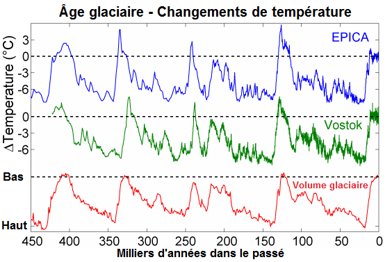

---

title: En général lorsque sont évoqués les épisodes d'ères glaciaires, c'est systématiquement le climat froid de l'hémisphère nord qui est représenté. Mais comment le climat des autres continents a été affecté durant ces époques ?
slug: en-general-lorsque-sont-evoques-les-episodes-d-eres-glaciaires-c-est-systematiquement-le-climat-froid-de-l-hemisphere-nord-qui-est-represente-mais-comment-le-climat-des-autres-continents-a-ete-affecte-durant-ces-epoques
date: '2023-07-29'
draft: true
categories:
- Comment
tags: []
coverImage: ./images/qimg-10d13efc2fa02f5f1b3011f54fd3da7a.png
---

*Réponse publiée [sur Quora](https://fr.quora.com/En-g%C3%A9n%C3%A9ral-lorsque-sont-%C3%A9voqu%C3%A9s-les-%C3%A9pisodes-d-%C3%A8res-glaciaires-c-est-syst%C3%A9matiquement-le-climat-froid-de-l-h%C3%A9misph%C3%A8re-nord-qui-est-repr%C3%A9sent%C3%A9-Mais-comment-le-climat-des-autres/answer/Dr-Goulu)*

Les [Glaciations](w:Glaciation)sont des phénomènes qui affectent toute la planète, on le sait désormais grâce aux forages de glace en Antarctique.

Il est donc faux de dire que c'est "systématiquement le climat froid de l'épisode nord qui est représenté".

[https://lejournal.cnrs.fr/articl...](https://lejournal.cnrs.fr/articles/comment-la-carotte-a-revolutionne-la-climatologie)
