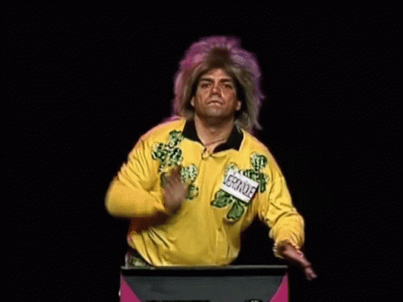

---

title: Est-ce que le moment de écriture le moment où auteur écrit et narrer (dans le roman autobiographique) ou ça revient au narrateur, et la relation d 'utilisation du présent de l'énonciation au moment de l'écriture ?
slug: est-ce-que-le-moment-de-ecriture-le-moment-ou-auteur-ecrit-et-narrer-dans-le-roman-autobiographique-ou-ca-revient-au-narrateur-et-la-relation-d-utilisation-du-present-de-l-enonciation-au-moment-de-l-ecriture
date: '2023-11-28'
draft: true
categories:
- Quora
tags: []
coverImage: ./images/qimg-79e35c56791343b22c6f2126b96d1029.gif
---

*Réponse publiée [sur Quora](https://fr.quora.com/Est-ce-que-le-moment-de-%C3%A9criture-le-moment-o%C3%B9-auteur-%C3%A9crit-et-narrer-dans-le-roman-autobiographique-ou-%C3%A7a-revient-au-narrateur-et-la-relation-d-utilisation-du-pr%C3%A9sent-de-l-%C3%A9nonciation/answer/Dr-Goulu)*

