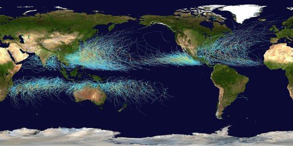

*Réponse publiée [sur Quora](https://fr.quora.com/Est-il-possible-qu-un-cyclone-passe-l-%C3%A9quateur-Est-ce-qu-il-inverse-alors-son-sens-de-rotation/answer/Dr-Goulu)*

Ils ne traversent pas l'équateur. Jamais. Exactement pour la raison que vous dites.

C'est la trajectoire de tous les cyclones répertoriés entre 1985 et 2005 (source [Nomenclature des cyclones tropicaux | Wikiwand](https://web.archive.org/web/20210725220739/https://www.wikiwand.com/fr/Nomenclature_des_cyclones_tropicaux) )
