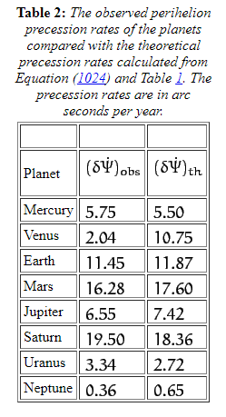

*Réponse publiée [sur Quora](https://fr.quora.com/La-terre-atteint-elle-son-p%C3%A9rih%C3%A9lie-au-m%C3%AAme-endroit-par-rapport-aux-%C3%A9toiles-au-fil-du-temps/answer/Dr-Goulu)*

Presque.

La précession du périhélie de l'orbite de la Terre est d'environ 12 secondes d'arc par année, ça prend environ 112'000 ans. pour qu'elle fasse un tour de l'orbite, ce qui correspond a un des [Paramètres de Milanković](w:)

[Apsidal precession](w:en:Apsidal_precession)

Merci pour la question qui m'a permis de découvrir cette page

[https://farside.ph.utexas.edu/te...](https://farside.ph.utexas.edu/teaching/336k/Newton/node115.html)

qui montre le calcul de la précession en mécanique classique et les valeurs mesurées :

On remarque que :

1. l'écart (du en partie à la relativité) ne diminue pas avec la distance au Soleil comme je l'avais imaginé
2. L'écart énorme de Vénus nous met sur la voie : la faible [Excentricité orbitale](w:)d'une planète provoque une plus grande sensibilité de son périhélie / aphélie par rapport aux perturbations
3. Mercure a l'orbite la plus excentrique des planètes du système solaire, ce qui la rend moins sensible à ces perturbations, et sa proximité au Soleil renforce l'effet relativiste, quasiment insensible pour les autres planètes.
