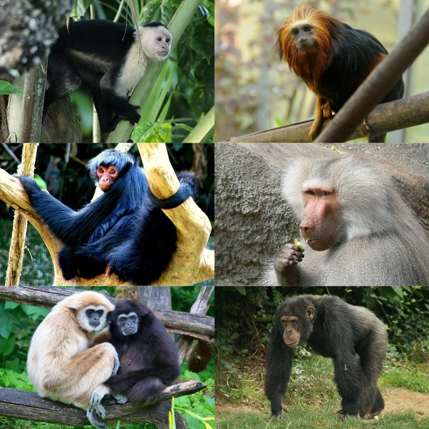

---

title: Les singes semblent tellement intelligents et similaires aux humains dans leur comportement et pourtant, il manque un tout petit je ne sais quoi qui fait toute la différence… Quel est-il ? L'ingéniosité ?
slug: les-singes-semblent-tellement-intelligents-et-similaires-aux-humains-dans-leur-comportement-et-pourtant-il-manque-un-tout-petit-je-ne-sais-quoi-qui-fait-toute-la-difference-quel-est-il-l-ingeniosite
date: '2023-06-04'
draft: true
categories:
- Quora
tags: []
coverImage: ./images/qimg-b21819e4a4d1a0b992fe8e8048812104.jpg
---

*Réponse publiée [sur Quora](https://fr.quora.com/Les-singes-semblent-tellement-intelligents-et-similaires-aux-humains-dans-leur-comportement-et-pourtant-il-manque-un-tout-petit-je-ne-sais-quoi-qui-fait-toute-la-diff%C3%A9rence-Quel-est-il-L/answer/Dr-Goulu)*

Il existe 285 espèces de [Singes](w:Simiiformes) et nous sommes l'une d'entre elles.

Chacune a plein de tout petits je ne sais quoi de différences avec les autres, qui fait que ce sont des espèces aussi différentes entre elles qu'avec nous (et vice-versa).

Avec
