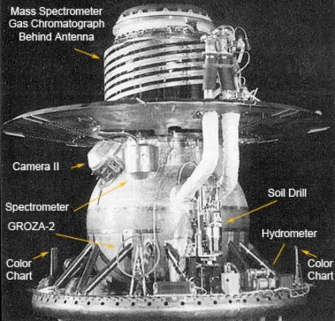

*Réponse publiée [sur Quora](https://fr.quora.com/On-dit-que-la-temp%C3%A9rature-de-V%C3%A9nus-est-trop-%C3%A9lev%C3%A9e-pour-%C3%AAtre-explor%C3%A9e-Pourquoi-la-NASA-ny-envoie-t-elle-pas-un-drone-pour-lexplorer/answer/Dr-Goulu)*

Parce que la NASA sait que le drone serait cuit et écrabouillé bien avant d'atteindre la surface de Vénus.

La pression de l'[Atmosphère de Vénus](w:) est de 93 bars, soit la pression qu'il y a sur Terre à 930m de profondeur dans les océans, donc la sonde (russe) [Venera 13](w:) qui détient le record de survie sur Vénus avec 127 minutes ressemblait plus à un bathyscaphe qu'à un drone :

La densité de l'atmosphère au niveau du sol est de 50x celle de la Terre , ce qui fait que les sondes vénusiennes n'ont même pas besoin de parachute ! Le frottement dans l'air de la sonde est suffisant pour la freiner, et à la fin elles "coule" dans l'atmosphère presque comme dans de l'eau jusqu'au sol.

Enfin, ce qui limite la durée de vie des sondes, c'est évidemment la température : 467°C ! A cette température, aucune électronique, aucun moteur ne fonctionne plus.

Les sondes [Venera ont utilisé de grosses isolations et embarquaient un gros volume de matière froide](https://web.archive.org/web/20221117101206/https://space.stackexchange.com/questions/9930/what-cooling-improvements-did-the-venera-missions-make).

Pour résister plus longtemps, il faut absolument refroidir activement la sonde. Et refroidir un truc quand il fait 467°C dehors, c'est pas simple. En fait on ne sait pas faire une pompe à chaleur qui fait ça. Il existe un [projet de système de refroidissement qui durerait 24h](https://web.archive.org/web/20230205225651/https://www.1-act.com/resources/tech-papers/24-hour-consumable-based-cooling-system-for-venus-lander/) en vaporisant de l'ammoniac et en l'évacuant dans l'atmosphère vénusienne.

Mais mon projet préféré est le [Automaton Rover for Extreme Environments](w:), un rover purement mécanique, utilisant une éolienne Savonius pour recharger un ressort spiral pour l'alimentation en énergie, un "ordinateur" à cames et engrenages genre machine de Babbage, et l'envoi d'informations vers une sonde en orbite en bougeant un réflecteur radar…
