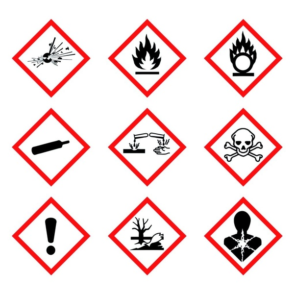

*Réponse publiée [sur Quora](https://fr.quora.com/Pensez-vous-que-tous-les-produits-industriels-soient-un-danger-pour-la-sant%C3%A9/answer/Dr-Goulu)*

Les produits qui sont dangereux pour la santé sont identifiés, règlementés et clairement signalés

Détails ici :

[https://www.preventionbtp.fr/con...](https://web.archive.org/web/20240626105251/https://www.preventionbtp.fr/content/download/893521/10262862/file/I6A0415.pdf)

On ne peut pas en dire autant des produits naturels : champignons, animaux et plantes toxiques fontet des milliers de morts par an parce qu'ils n'ont pas de pictogrammes dessus.

Et je ne parle pas de l'alcool et du tabac, en bonne partie naturels…
