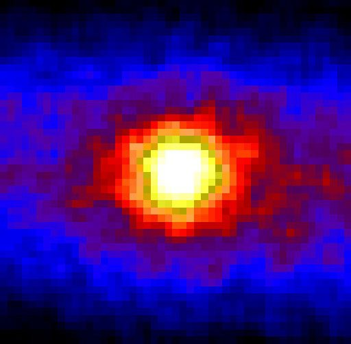

---

title: Pourquoi avoir choisi d'installer le détecteur de neutrinos ORCA (projet KM3NeT), près de Toulon ? Ne risque-t-il pas d'y avoir des difficultés liées aux flux de neutrinos des réacteurs des sous-marins nucléaires d'attaque et du Charles de Gaulles ?
slug: pourquoi-avoir-choisi-d-installer-le-detecteur-de-neutrinos-orca-projet-km3net-pres-de-toulon-ne-risque-t-il-pas-d-y-avoir-des-difficultes-liees-aux-flux-de-neutrinos-des-reacteurs-des-sous-marins-nucleaires-d-attaque-et-du-charles-de
date: '2023-11-08'
draft: true
categories:
- Pourquoi
tags: []
coverImage: ./images/qimg-499203a15a86a64a37b4e9515f6c5c02.jpg
---

*Réponse publiée [sur Quora](https://fr.quora.com/Pourquoi-avoir-choisi-d-installer-le-d%C3%A9tecteur-de-neutrinos-ORCA-projet-KM3NeT-pr%C3%A8s-de-Toulon-Ne-risque-t-il-pas-d-y-avoir-des-difficult%C3%A9s-li%C3%A9es-aux-flux-de-neutrinos-des-r%C3%A9acteurs-des/answer/Dr-Goulu)*

Vous imaginez bien que les concepteurs y ont pensé…

Ce détecteur ne detecte que les neutrinos arrivant depuis le fond de la mer, pas ceux venant de la surface.

[https://fr.wikipedia.org/wiki/KM...](w:KM3NeT)

Vous connaissez cette magnifique image du soleil ?

Elle a été faite au Japon, en observant les neutrinos qui traversent la Terre jusqu'à un immense réservoir installé dans une mine à 1000m de profondeur

[http://strangepaths.com/the-sun-...](http://strangepaths.com/the-sun-seen-through-the-earth-in-neutrino-light/2007/01/06/en/)
