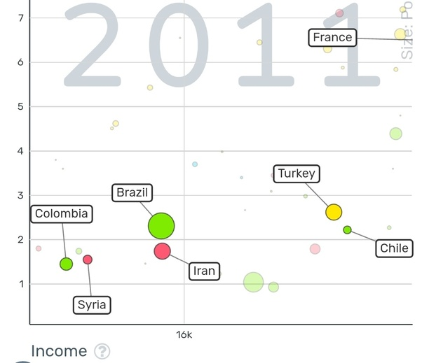

---

title: Pourquoi dans les classements des 100 plus grandes entreprises mondiales, des dépôts de brevets, des universités, des hôpitaux, la part des pays a majorité musulmane est elle presque inexistante ?
slug: pourquoi-dans-les-classements-des-100-plus-grandes-entreprises-mondiales-des-depots-de-brevets-des-universites-des-hopitaux-la-part-des-pays-a-majorite-musulmane-est-elle-presque-inexistante
date: '2023-12-04'
draft: true
categories:
- Pourquoi
tags: []
coverImage: ./images/qimg-97ddcfbdee8865a69f7d7925eb4d5767.jpg
---

*Réponse publiée [sur Quora](https://fr.quora.com/Pourquoi-dans-les-classements-des-100-plus-grandes-entreprises-mondiales-des-d%C3%A9p%C3%B4ts-de-brevets-des-universit%C3%A9s-des-h%C3%B4pitaux-la-part-des-pays-a-majorit%C3%A9-musulmane-est-elle-presque/answer/Dr-Goulu)*

Vous avez fait une étude de corrélation qui montre que c'est plus lié à la religion qu'au PIB par habitant par exemple ?

Parce que quand les pays musulmans étaient plus riches que les chrétiens, c'était l'inverse

[https://fr.wikipedia.org/wiki/Sc...](w:Sciences_arabes)

.

Peut-être que c'est effectivement une des causes des problèmes actuels de certains pays musulmans : ils voient les vestiges de leur gloire passée, la regrettent, et pensent la retrouver dans un retour aux valeurs du passé.

Pour en revenir au premier paragraphe je vous ai vite fait un petit Gapminder sur le nombre de lits d'hôpital pour 1000 habitants en fonction du PIB par habitant avec quelques pays musulmans et leur voisin le plus proche dans le graphique :

Je vois bien le lien avec le PIB, mais pas trop avec la religion…
