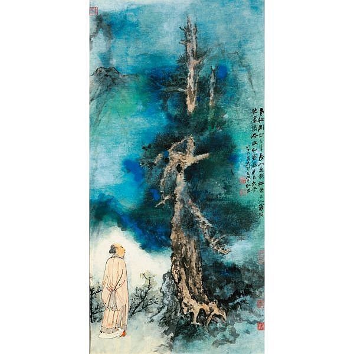
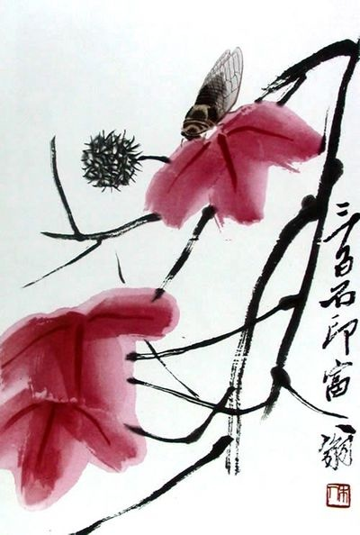

*Réponse publiée [sur Quora](https://fr.quora.com/Pourquoi-les-riches-Chinois-de-Chine-n-ont-pas-l-air-d-appr%C3%A9cier-Picasso-ni-les-impressionnistes/answer/Dr-Goulu)*

Et vous, comment appréciez vous ce tableau:

Pas mal n'est-ce pas ? C'est une toile de [Chang Dai-chien](w:), l'artiste chinois le plus coté devant [Qi Baishi](w:), qui peignait des choses comme ça :

Ces deux peintres sont devant Andy Warhol et Pablo Picasso en terme de ventes (en millions de dollars total de leurs oeuvres) et pourtant, comme moi, vous n'en aviez probablement jamais entendu parler. Pourquoi ?

Parce que la culture est différente. L'impressionnisme ou le cubisme ont un sens dans la culture occidentale. Pas en Chine.

Par exemple Qi Bashi

> fit preuve d'une audace remarquable en créant le style « fleurs rouges et feuillage d'encre » (红花墨叶, [hónghuā mòyè](w:Hónghuā_mòyè)) qui consistait à employer des couleurs vives en contraste avec les noirs et gris du lavis. L'effet fut comparable à celui du fauvisme en Europe, vigoureux et décoratif. La peinture chinoise lui doit certainement cette prise de conscience du rôle des couleurs.
>
>
>
> (Wikipedia)
