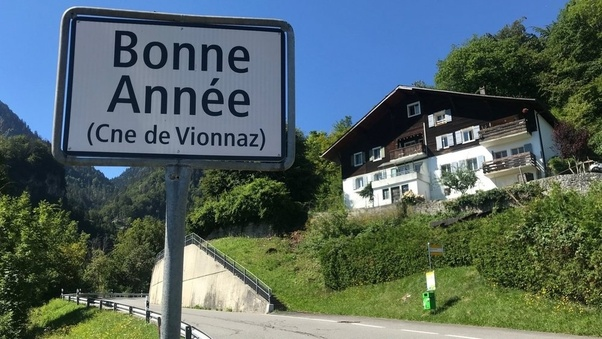

*Réponse publiée [sur Quora](https://fr.quora.com/Quel-est-le-nom-des-habitants-d-une-ville-ou-d-un-village-le-plus-loufoque-que-vous-connaissez/answer/Dr-Goulu)*

un hameau de la commune de [Vionnaz](w:). 15 habitants dont j'ignore le gentilé …

[https://www.rhonefm.ch/actualite...](https://web.archive.org/web/20230313/https://www.rhonefm.ch/actualites/en-valais-cest-unique-au-monde-bienvenue-bonne-annee)
