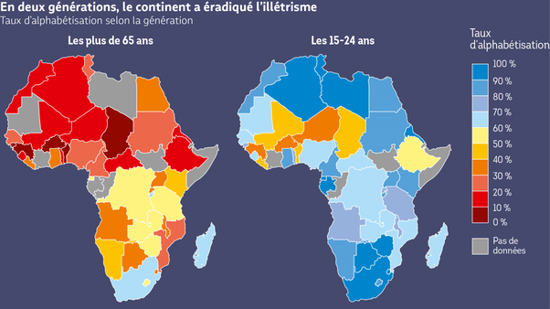

*Réponse publiée [sur Quora](https://fr.quora.com/Qui-peut-%C3%A9labor%C3%A9-une-matrice-de-l-%C3%A9ducation-en-Afrique/answer/Dr-Goulu)*

J'espère vraiment que ce sera quelqu'un qui connaît la différence entre l'infinitif et le participe passé.

Ca permettrait à l'Afrique de remonter le niveau global de l'humanité, francophone en tout cas.

Et accessoirement de me faire moins mal aux yeux.

edit : un petit ajout constructif quand même :

je ne sais pas ce que vous appelez "matrice de l'éducation" mais cette carte me semble tout de même parlante

source :

[https://www.pourleco.com/monde/a...](https://web.archive.org/web/20230208125452/https://www.pourleco.com/monde/afrique-en-deux-generation-le-continent-vaincu-lanalphabetisme)
