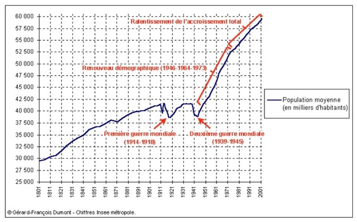

*Réponse publiée [sur Quora](https://fr.quora.com/Si-les-guerres-les-famines-et-les-%C3%A9pid%C3%A9mies-%C3%A9taient-%C3%A9radiqu%C3%A9es-cela-risquerait-il-daugmenter-la-surconsommation-et-donc-de-d%C3%A9truire-la-plan%C3%A8te/answer/Dr-Goulu)*

Il faut arrêter avec l'idée de "détruire la planète". Nous ne pouvons absolument pas détruire la planète, ni même éliminer toute vie, même avec une guerre nucléaire totale. Nous pouvons causer l'extinction de beaucoup d'espèces, y compris la notre, rien de plus.

Les guerres sont pratiquement éradiquées. La moyenne ces dernières années a été de l'ordre de 100'000 morts par an[[1]](#MkdTz) . Sur 57.3 millions de morts par an[[2]](#PmFcR) il y a donc moins de 2 personnes sur 1000 qui meurent dans une guerre. Triste, mais démographiquement négligeable. Pour fixer les idées, les accidents de la route font 500'000 morts par an, 5x plus que les guerres …

La famine, c'est nettement pire: 11 millions de personnes en meurent chaque année.[[3]](#UAHVP) 20% des humains meurent de carences alimentaires, et ça c'est vraiment horrible.

Pour les épidémies, on est un peu biaisés parce qu'on vient d'en vivre une qui a fait 6 millions de morts, et qu'on a déjà un peu oublié le SIDA qui a fait 30 millions de morts jusqu'ici. mais ce sont des événements ponctuels. Si on fait une moyenne, ces maladies n'apparaissent pas parmi les principales causes de mortalité des humains[[4]](#Jmpqa) Je n'ai pas trouvé les chiffres , si vous les trouvez merci de mettre le lien en commentaire.

Quelles sont les conséquences de toutes ces morts sur notre nombre ? Nulles. Comme toutes les espèces, **nous compensons la mortalité excédentaire immédiatement par plus de naissances**. "Preuve" avec la population de la France :

La terrible mortalité de la première guerre mondiale (et la grippe espagnole qui a eu lieu en même temps) était compensée dès 1930 environ, et la mortalité de la 2ème guerre mondiale combinée à la baisse de la natalité due au déficit de naissances 20 ans plus tôt ont été compensées dès 1950, suivis du fameux "baby boom" qui a produit votre serviteur et quelques millions d'autres européens.

Si vous prolongez mentalement la courbe d'avant 1900, vous pourriez avoir l'impression qu'on serait moins sans les 2 guerres mondiales…

En fait ce qui augmente la population, c'est ce qu'on appelle la [Transition démographique](w:).

Elle s'est produite en Europe, puis en Asie et en Amérique du Sud, et maintenant c'est le tour de l'Afrique : l'amélioration des conditions de vie **réduit la mortalité, ce qui réduit la natalité, mais avec du retard.**La population augmente très rapidement pendant ce décalage :

Si vous voulez bien comprendre la démographie, je vous conseille les géniale conférences de [Hans Rosling au TED](https://web.archive.org/web/20230706062828/https://www.ted.com/speakers/hans_rosling) .

Sur la transition démographique il y a "[Religions et Bébés](https://web.archive.org/web/20230617155638/https://www.ted.com/talks/hans_rosling_religions_and_babies)" qui montre que nous serons 10 milliards non pas par l'arrivée de plus d'enfants, mais par allongement de l'espérance de vie, et sur les conséquences sur l'économie il y a "[Croissance de la population boîte par boîte](https://web.archive.org/web/20230715025513/https://www.ted.com/talks/hans_rosling_global_population_growth_box_by_box?language=fr)"

Notes de bas de page

[[1]](#cite-MkdTz)[War and Peace](https://ourworldindata.org/war-and-peace)

[[2]](#cite-PmFcR)[Décès dans le monde](https://www.planetoscope.com/mortalite/22-deces-dans-le-monde.html)

[[3]](#cite-UAHVP)[D’après un rapport de l’ONU, la faim dans le monde progresse et pourrait avoir touché jusqu’à 828 millions de personnes en 2021](https://www.who.int/fr/news/item/06-07-2022-un-report--global-hunger-numbers-rose-to-as-many-as-828-million-in-2021)

[[4]](#cite-Jmpqa)[Les 10 principales causes de mortalité](https://www.who.int/fr/news-room/fact-sheets/detail/the-top-10-causes-of-death)
