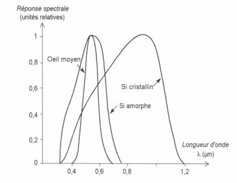

*Réponse publiée [sur Quora](https://fr.quora.com/Est-ce-que-le-rendement-d-une-captation-d-%C3%A9nergie-issu-du-rayonnement-solaire-d-un-panneau-solaire-serait-meilleur-si-la-couche-d-ozone-de-la-plan%C3%A8te-serait-ind%C3%A9sirablement-r%C3%A9duite-Avec/answer/Dr-Goulu)*

Très peu pour le silicium amorphe et pratiquement pas pour le cristallin parce que les UV B et C bloqués par la couche d'ozone ont une longueur d'onde inférieure à 315 nm, donc plus bas que le spectre capté par les cellules

