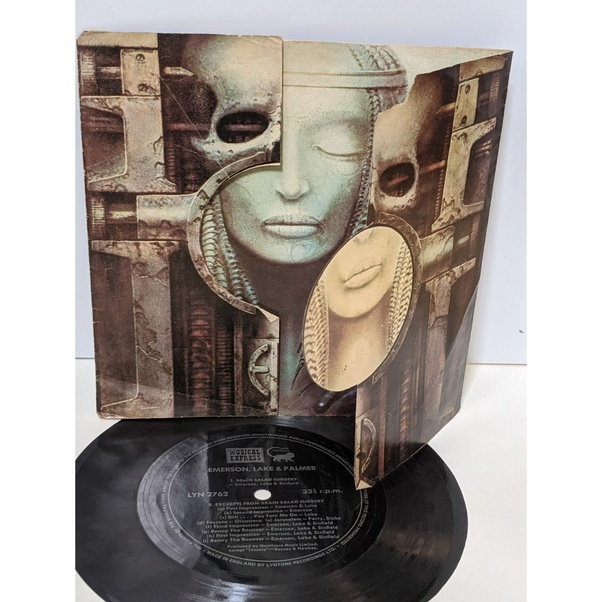

*Réponse publiée [sur Quora](https://fr.quora.com/Quelles-sont-les-plus-belles-pochettes-d-album-des-ann%C3%A9es-70/answer/Dr-Goulu)*

La seule que j'aie gardé est "[Brain Salad Surgery](w:)" d'Emerson, Lake and Palmer de 1973.

Elle a été dessinée par H. R. Giger, le créateur d'Alien. C'est pas joyeux joyeux, mais magnifique :

