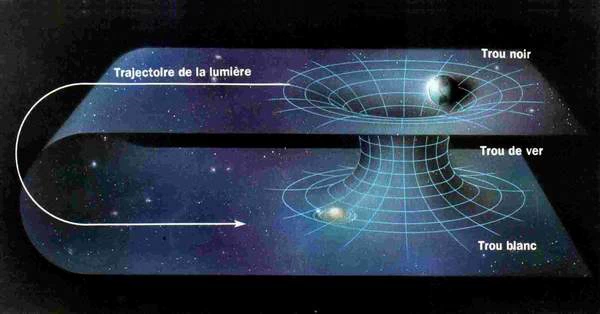

*Réponse publiée [sur Quora](https://fr.quora.com/Comment-les-trous-de-ver-permettent-de-voyager-%C3%A0-des-vitesses-sup%C3%A9rieure-%C3%A0-celle-de-lumi%C3%A8repar-quelle-ph%C3%A9nom%C3%A8ne/answer/Dr-Goulu)*

La première chose à bien préciser, c'est que les [Trous de ver](w:Trou_de_ver)sont des solutions mathématiques aux équations de la relativité générale qui ont beaucoup de solutions mathématiques, dont très peu correspondent à des réalités physiques.

Il existe même plusieurs solutions décrivant des trous de ver, certaines impliquant des "trous blancs", d'autres de la masse ou de l'énergie négative, ou tout à la fois.

Hélas on n'observe strictement rien qui ressemble à un trou de ver ou aux objets censés l'accompagner, donc les trous de ver sont considérés comme "hypothétiques", mot scientifique voulant dire "jusqu'à preuve du contraire ils n'existent pas".

Mais s'ils existaient, ce serait des "raccourcis" dans l'espace temps : en les empruntant, vous iriez d'un point A à un point B en passant par un chemin plus court que la ligne droite (ou géodésique) dans l'espace temps normal.

Donc vous n'iriez pas plus vite que la lumière (ça c'est formellement interdit par toutes les solutions de la relativité générale) mais en passant par le raccourci vous donneriez cette impression à un observateur qui ne sait pas qu'il y a un raccourci :

Comme on le voit sur le dessin, un trou de ver plus court que le trajet "normal" implique plutôt un espace temps très courbe, or à grande échelle l'univers est très plat…

Réflexion plus générale sur ce sujet :

[https://www.drgoulu.com/2016/09/...](/2016/09/11/solutions-admissibles/)
