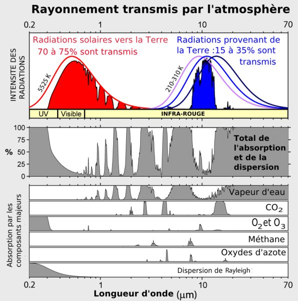

*Réponse publiée [sur Quora](https://fr.quora.com/Mars-7-fois-plus-petite-que-la-Terre-mais-plus-loin-du-Soleil-sans-eau-mais-96-CO2-se-r%C3%A9chauffe-t-elle/answer/Dr-Goulu)*

> La température moyenne sur Mars est −63°C (à comparer aux 15 à 18 °C sur Terre). Cette température est causée par la faible densité de l'atmosphère qui fait que l’[effet de serre](w:) induit n'est que de 3° (33° pour la [Terre](w:))
>
>
>
> ([Atmosphère de Mars — Wikipédia](w:Atmosphère_de_Mars))

D'autre part il faut bien comprendre comment fonctionne l'effet de serre :

1. Sur Terre, le principal gaz à effet de serre est la vapeur d'eau. Il y en a environ 13'000 milliards de tonnes dans notre atmosphère [[1]](#AkEZv), ce qui représente environ la moitié de la masse totale de l'atmosphère de Mars
2. La vapeur et le CO2 captent les infrarouges émis par le sol, pas la lumière du soleil.

Si vous regardez le fameux [graphique qui vaut 10000 mots](https://www.drgoulu.com/2011/11/13/climat-le-graphique/),

Sur une planète (presque) sans eau et froide comme Mars (courbe noire), vous voyez qu'il n'y a pratiquement que le petit bloc à 15um qui absorbe la chaleur de la surface de Mars, et que sur Terre, 0.04% de CO2 suffisent à bloquer la totalité du rayonnement à cette longueur d'onde, donc que 98% de CO2 ne feraient pas des milliers de fois plus. (mais plus quand même, n'en déplaise aux climatosceptiques)

Si vous vouliez demander si un réchauffement climatique a lieu actuellement sur Mars, il semblerait que oui.

"Semblerait" parce qu'on a pas assez de données fiables dans le temps et l'espace pour en être certains.

Notes de bas de page

[[1]](#cite-AkEZv)[Cycle de l'eau — Wikipédia](w:Cycle_de_l'eau)
