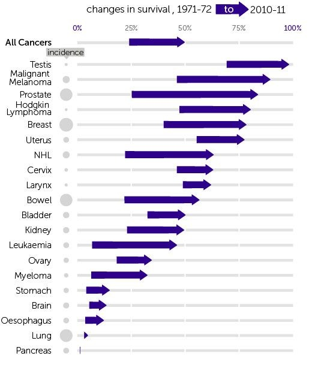

*Réponse publiée [sur Quora](https://fr.quora.com/Comment-apr%C3%A8s-toutes-ces-substances-pouvant-aider-la-recherche-contre-le-Cancer-d%C3%A9couvertes-sur-des-organismes-vivants-se-fait-il-qu-il-y-ai-peu-de-progression-contre-les-cancers/answer/Dr-Goulu)*

Il y a eu d'énormes progrès dans la lutte contre la plupart des cancers

[https://www.cancerresearchuk.org...](https://www.cancerresearchuk.org/health-professional/cancer-statistics/survival/common-cancers-compared)
