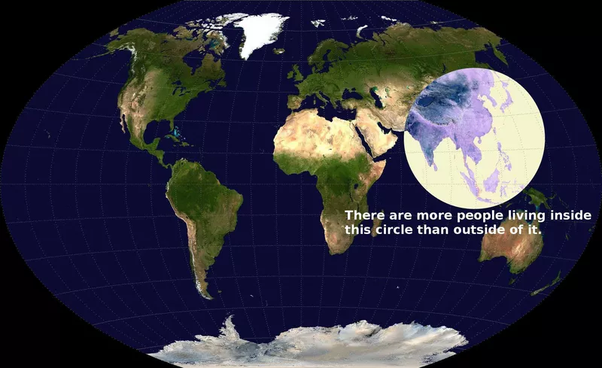

*Réponse publiée [sur Quora](https://fr.quora.com/Faut-il-dissoudre-lONU-et-la-remplacer-par-Organisation-plus-%C3%A9quitable-envers-toutes-les-nations/answer/Dr-Goulu)*

Oui, et il faut aussi la paix dans le monde, que tout le monde soit heureux, riche, en bonne santé, beau et gentil.

Je soutiens à 100% les programmes électoraux de Miss Monde et des Bisounours, mais leur mise en œuvre m'inquiète un peu.

Après la 2ème guerre mondiale, l'ONU a remplacé la SDN, qui avait été créée après la première guerre mondiale, donc je crains qu'il faille attendre la fin d'une 3ème guerre mondiale pour créer votre Organisation…

Et si vous rêvez d'une démocratie mondiale, n'oubliez pas où se trouve la majorité des humains :

