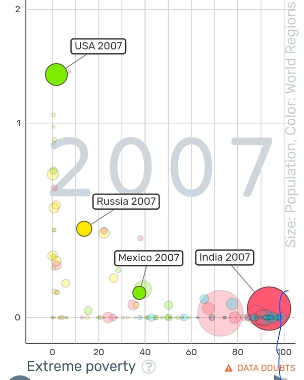

*Réponse publiée [sur Quora](https://fr.quora.com/Est-ce-que-je-me-trompe-si-jaffirme-quen-France-et-ailleurs-le-nombre-de-pauvres-est-directement-proportionnel-avec-le-nombre-de-milliardaires/answer/Dr-Goulu)*

Ca n'a pas l'air corrélé du tout dans le monde

[https://www.gapminder.org/tools/...](https://www.gapminder.org/tools/#$model$markers$bubble$encoding$y$data$concept=dollar_billionaires_per_million_people&source=sg&space@=country&=time;;&scale$domain:null&zoomed@=0.0&=2;&type=linear;;&x$data$concept=poverty_percent_people_below_685_a_day&source=sg&space@=country&=time;;&scale$domain:null&zoomed:null&type:null;;&frame$speed:100&value=2007;&trail$data$filter$markers$fra=2004;;;;;;;;&chart-type=bubbles&url=v1)
