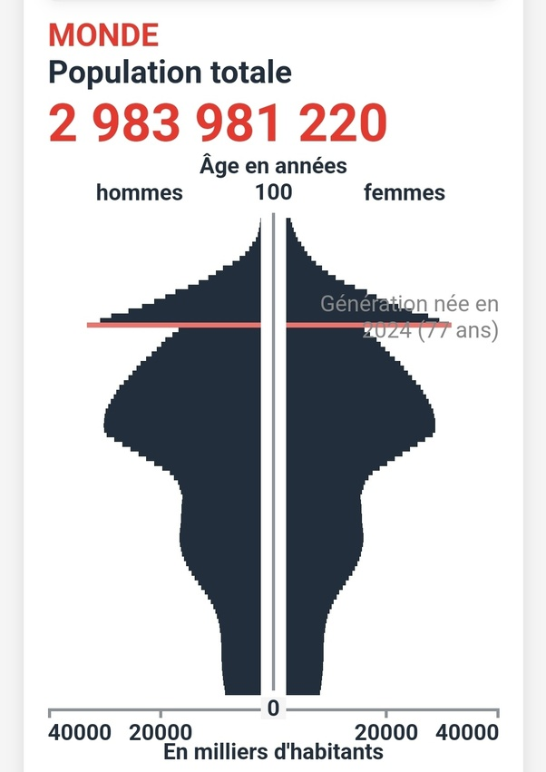

*Réponse publiée [sur Quora](https://fr.quora.com/Existe-t-il-des-moyens-pour-r%C3%A9duire-la-population-mondiale-%C3%A0-3-milliards/answer/Dr-Goulu)*

En combien de temps ?

En jouant avec le simulateur de l'ined

[https://www.ined.fr/fr/tout-savo...](https://www.ined.fr/fr/tout-savoir-population/jeux/population-demain/)

On voit que:

- Si on interdit carrément d'avoir des enfants, la population descend sous 3 milliards en 2076. Le problème c'est qu'alors toutes les femmes auront plus de 52 ans, donc c'est l'extinction dans un siècle.
- Avec la "politique de l'enfant unique", la population descend à 3 milliards en 2101 avec des problèmes sociaux que je vous laisse imaginer d'après la pyramide des âges qui en résulterait :

